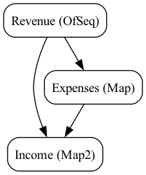

# Orcaset - Financial Models for Computers

Orcaset is a financial modeling framework designed to correctly and efficiently orchestrate analysis at any scale. 

Orcaset uses strong typing and runtime safety checks to prevent users and agents from accidentally creating malformed models. Strong protections give end-users confidence that large-scale modifications do not cause hidden errors.

* **Build and Update with Confidence** - Strong typing prevents invalid models and helps agents navigate deep formula dependencies. Confidently modify models without breaking them.
* **Transparent and Deterministic** - Calculations are open and transparent. Build and inspect dependency trees to audit model calculations. No black boxes.
* **Efficient Construction** - Faster and cheaper than spreadsheet automation. Re-use components across models and scenarios. Save tokens by writing formulas once per line item, not once per cell.

## Installation

Add to an `opam` switch.

```sh
opam pin add orcaset https://github.com/Orcaset/orcaset-oc.git
```

## Orcaset at a glance

Orcaset models are constructed by defining and combining line item formulas. Values are materialized by querying over dates. Values are internally cached during each query to efficiently resolve outputs. Direct and indirect circular dependencies are resolved iteratively, similar to how they are resolved in a spreadsheet.

### Creating a simple model

Create a simple model with revenue, expenses, and income matching the following definition:

* **Revenue**: Grows at a constant quarterly rate
* **Expenses**: Fixed percentage of revenue
* **Income**: Sum of revenue and expenses

```ocaml
open Orcaset

let start_period = Period.make (Date.make 2025 12 31) (Date.make 2026 3 31)
let offset = Offset.make ~months:3 ~month_end:true ()

let revenue =
  Series.Spans.unfold ~label:"Revenue" ~agg:Series.Agg.sum
    ~deps:(fun () -> Series.Deps.none)
    ~init:(start_period, 1_000.0)
    ~cells:(fun () (period, value) ->
      let next_period = Period.next offset period in
      let next_value = value *. 1.05 in
      Some
        ( Series.Spans.cell ~period ~split:Series.proportional_split (Series.Formula.pure value),
          (next_period, next_value) ))
    ()

let expenses = Series.Spans.map ~label:"Expenses" (fun r -> r *. -0.30) revenue
let income = Series.Spans.sum ~label:"Income" ~agg:Series.Agg.sum [ revenue; expenses ]
```

These fifteen lines of code create a model that is deterministic, tracks all dependencies, and can be queried for values over *any* span of time.

### Querying values

While you can query granular results for specific series, it's often helpful to view many line items over many periods in a statement format. Orcaset's `Stmt` module allows users to create and query over different statement views.

```ocaml
let stmt = Stmt.span_total income (Stmt.span_lines [ revenue; expenses ])

let query_periods =
  Period.make_seq ~start:(Period.start start_period) ~offset |> Seq.take 4 |> List.of_seq

let () =
  let resolved = Stmt.eval_periods query_periods stmt in
  Printf.printf "\n%s\n\n" (Stmt.fixed_width resolved)

(* 
            2026-03-31  2026-06-30  2026-09-30  2026-12-31
  Revenue      1000.00     1050.00     1102.50     1157.62
  Expenses     -300.00     -315.00     -330.75     -347.29
            ----------  ----------  ----------  ----------
Income          700.00      735.00      771.75      810.34 *)
```

This example prints out the table to the console using a fixed-width table format, but you can create your own formatters save outputs to JSON, CSV, markdown, or any other format.

As mentioned previously, orcaset automatically interpolates partial periods meaning you can query over partial periods. You can also easily aggregate over multiple periods without changing the model (e.g. annual view of quarterly detail).

```ocaml
let partial_period = Period.make (Date.make 2026 1 20) (Date.make 2026 3 13)
let annual_period = Period.make (Date.make 2025 12 31) (Date.make 2026 12 31)

let () =
  let resolved = Stmt.eval_periods [ partial_period; annual_period ] stmt in
  Printf.printf "\n%s\n\n" (Stmt.fixed_width resolved)

(* 
Queries with period end date labels:

            2026-03-13  2026-12-31
  Revenue       577.78     4310.12
  Expenses     -173.33    -1293.04
            ----------  ----------
Income          404.44     3017.09 *)
```

## Tracing dependencies

All calculations are fully traceable. You can inspect dependencies at both the line level and the individual number level.

```ocaml
(* Get the dependency graph starting from `income` *)
let dependencies = Series.dependencies (Series.Span_series income)
```

Rendering the graph to a image produces the chart below.



The arrows show the relationships between line items:

## Examples

See the [Examples](/examples/) folder for additional examples using orcaset.

## License

Orcaset is licensed under the Server Side Public License v1. See the LICENSE file for details.
