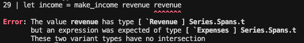

# Orcaset - Financial Models for Computers

Orcaset is a financial modeling framework designed to correctly and efficiently orchestrate analysis at any scale. 

Orcaset uses strong typing and runtime safety checks to prevent users and agents from accidentally creating malformed models. Strong protections give end-users confidence that large-scale modifications do not cause hidden errors.

* **Build and Update with Confidence** - Strong typing prevents invalid models and helps agents navigate deep formula dependencies. Confidently modify models without breaking them.
* **Transparent and Deterministic** - Calculations are open and transparent. Materialize and inspect query-specific traces to audit model calculations. No black boxes.
* **Efficient Construction** - Faster and cheaper than spreadsheet automation. Re-use components across models and scenarios. Save tokens by writing formulas once per line item, not once per cell.

## Installation

Add to an `opam` switch.

```sh
opam pin add orcaset https://github.com/Orcaset/orcaset-oc.git
```

## Orcaset at a glance

Orcaset models are constructed by defining and combining line item formulas. Values are materialized by querying over dates. Values are internally cached during each query to efficiently resolve outputs. Direct and indirect circular dependencies are resolved iteratively, similar to how they are resolved in a spreadsheet.

### Creating a simple model

Create a simple model with revenue, expenses, and income matching the following definition:

* **Revenue**: Grows at a constant quarterly rate
* **Expenses**: Fixed percentage of revenue
* **Income**: Sum of revenue and expenses

```ocaml
(* Imports and assumptions *)
open Orcaset

let sp = Series.Spans.pack
let start_period = Period.make (Date.make 2025 12 31) (Date.make 2026 3 31)
let offset = Offset.make ~months:3 ~month_end:true ()

let revenue =
  Series.Spans.unfold ~label:"Revenue" ~agg:Series.Agg.sum
    (* Initial unfold state *)
    ~init:(start_period, 1_000.0)
    (* Unfold step function returning Some (cell, next state) *)
    ~cells:(fun (period, value) ->
      let next_period = Period.next offset period in
      let next_value = value *. 1.05 in
      Some
        ( Series.Spans.cell ~period ~split:Split.daily (Series.Formula.pure (Some value)),
          (next_period, next_value) ))
    ()

(* Scale revenue by a scalar expense margin assumption *)
let expenses = Series.Spans.scale ~label:"Expenses" (-0.30) revenue
(* Add revenue and expenses to calculate income *)
let income = Series.Spans.sum ~label:"Income" ~agg:Series.Agg.sum [ sp revenue; sp expenses ]
```

This snipped creates a model that is deterministic, traceable, and can be queried for values over *any* span of time in only a dozen or so lines of code.

### Enforcing line item relationships with types

Line items carry phantom types that can be used to ensure combinators reference the correct type of dependencies.

In the previous example, we could define revenue as having a `` [ `Revenue ] `` type.

```ocaml
let revenue : [ `Revenue ] Series.Spans.t = ...
```

Then, the expenses and income constructors can be redefined to depend specifically on revenue series.

```ocaml
let make_expenses (revenue : [ `Revenue ] Series.Spans.t) : [ `Expenses ] Series.Spans.t =
  Series.Spans.scale ~label:"Expenses" (-0.30) revenue
let make_income (revenue : [ `Revenue ] Series.Spans.t) (expenses : [ `Expenses ] Series.Spans.t) :
    [ `Income ] Series.Spans.t =
  Series.Spans.sum ~label:"Income" ~agg:Series.Agg.sum [ sp revenue; sp expenses ]

let expenses = make_expenses revenue
let income = make_income revenue expenses
```

Passing the incorrectly typed series will cause a compile-time error that is caught quickly.



*For example, trying to build income from two revenue series raises a type error.*

Typing series in this manner makes models more composable and reusable. It allows components to be easily defined across files while ensuring their inputs are correct.

### Querying values

While you can query granular results for specific series, it's often helpful to view many line items over many periods in a statement format. Orcaset's `Stmt` module allows users to create and query over different statement views.

```ocaml
let stmt = Stmt.span_total income [ Stmt.span_line revenue; Stmt.span_line expenses ]

let query_periods =
  Period.make_seq ~start:(Period.start start_period) ~offset |> Seq.take 4 |> List.of_seq

let () =
  let resolved = Stmt.eval_periods query_periods stmt in
  Printf.printf "\n%s\n\n" (Stmt.fixed_width resolved)

(* 
            2026-03-31  2026-06-30  2026-09-30  2026-12-31
  Revenue      1000.00     1050.00     1102.50     1157.62
  Expenses     -300.00     -315.00     -330.75     -347.29
            ----------  ----------  ----------  ----------
Income          700.00      735.00      771.75      810.34 *)
```

This example prints out the table to the console using a fixed-width table format. Orcaset also has built-in formatters for CSV and markdown tables, and it's easy to create custom formatters to any other structure.

As mentioned previously, orcaset automatically interpolates partial periods meaning you can query over date ranges without worrying about period boundary alignment. You can also easily aggregate over multiple periods without changing the model (e.g. annual view of quarterly detail).

```ocaml
let partial_period = Period.make (Date.make 2026 1 20) (Date.make 2026 3 13)
let annual_period = Period.make (Date.make 2025 12 31) (Date.make 2026 12 31)

let () =
  let resolved = Stmt.eval_periods [ partial_period; annual_period ] stmt in
  Printf.printf "\n%s\n\n" (Stmt.fixed_width resolved)

(* 
Queries with period end date labels:

            2026-03-13  2026-12-31
  Revenue       577.78     4310.12
  Expenses     -173.33    -1293.04
            ----------  ----------
Income          404.44     3017.09 *)
```

## Tracing dependencies

All calculations are fully traceable. You can inspect the materialized cell graph for a specific query.

```ocaml
let trace =
  Series.trace_span (Series.make_cache ()) income
    ~period:(Period.make (Date.make 2025 12 31) (Date.make 2026 12 31))

let edges = Series.Trace.edges trace
```

Rendering the trace graph to an image produces the chart below.


The arrows show the relationships between line items:

## Examples

See the [Examples](/examples/) folder for additional examples using orcaset.

## License

Orcaset is licensed under the Server Side Public License v1. See the LICENSE file for details.
